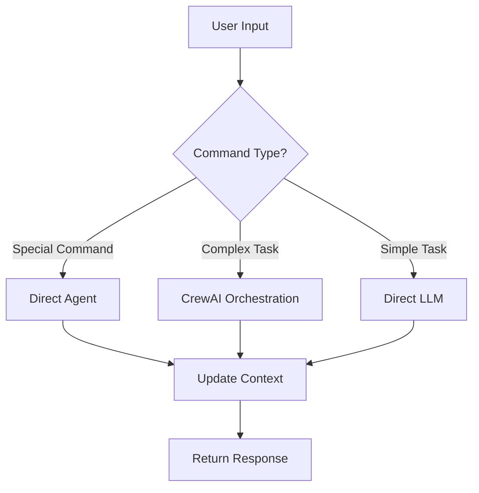

# Jarvis AI Assistant

A multi-context AI assistant powered by LLMs, built with FastAPI, LangChain, and CrewAI.

## 🚀 Features

- **Multi-Context Management**: Handle multiple tasks with persistent storage
- **Smart Agent Orchestration**: Uses AutoGen and CrewAI for complex task handling
- **Multiple LLM Support**: Local (Ollama) and Cloud (Bedrock) model integration
- **Vector Storage**: ChromaDB for semantic search and context retrieval
- **Caching**: Redis for fast context access
- **CLI Interface**: Rich command-line interface with task management

## 📋 Prerequisites

- Python 3.9+
- Docker and Docker Compose (for Redis and ChromaDB)
- AWS Account (for Bedrock access)
- Ollama (for local LLM support)

## 🛠️ Setup

1. **Clone the repository**
   ```bash
   git clone <repository-url>
   cd jarvis-ai
   ```

2. **Create and activate virtual environment**
   ```bash
   python -m venv venv
   # On Windows
   .\venv\Scripts\activate
   # On Unix/MacOS
   source venv/bin/activate
   ```

3. **Install dependencies**
   ```bash
   pip install -r requirements.txt
   ```

4. **Start required services**
   ```bash
   docker-compose up -d
   ```

5. **Configure environment variables**
   Create a `.env` file:
   ```env
   AWS_ACCESS_KEY_ID=your_access_key
   AWS_SECRET_ACCESS_KEY=your_secret_key
   AWS_REGION=your_region
   ```

## 🔄 Application Flow

### 1. Task Creation
- User submits a command or query
- System creates a new task with unique ID
- Initial context is stored in SQLite and vectorized in ChromaDB

### 2. Task Processing
The system follows this flow for each task:



### 3. Agent Types
- **Direct Agents**: Handle specific commands
  - `!sh`: System commands
  - `!file`: File operations
  - `!code`: Code-related tasks
  - `!summarize`: Text summarization

- **CrewAI Agents**: Handle complex tasks
  - Planner: Breaks down tasks
  - Executor: Implements solutions
  - Reviewer: Validates results

### 4. Context Management
- SQLite: Stores task metadata and history
- Redis: Caches active contexts
- ChromaDB: Stores vector embeddings for semantic search

## 💻 Usage

### Basic Commands

1. **Start a new task**
   ```bash
   python -m src.jarvis.cli "Your command here"
   ```

2. **Continue an existing task**
   ```bash
   python -m src.jarvis.cli --task <task_id> "Your next command"
   ```

3. **List all tasks**
   ```bash
   python -m src.jarvis.cli list-tasks
   ```

4. **Summarize a task**
   ```bash
   python -m src.jarvis.cli summarize <task_id>
   ```

### Example Use Cases

1. **Simple Query**
   ```bash
   python -m src.jarvis.cli "What is the weather like today?"
   ```

2. **File Operation**
   ```bash
   python -m src.jarvis.cli "!file read example.txt"
   ```

3. **Code Analysis**
   ```bash
   python -m src.jarvis.cli "!code analyze src/main.py"
   ```

4. **Complex Task**
   ```bash
   python -m src.jarvis.cli "Analyze the codebase and suggest improvements for error handling"
   ```

## 📁 Project Structure

```
jarvis-ai/
├── src/
│   └── jarvis/
│       ├── agents/         # Agent implementations
│       ├── api/           # FastAPI endpoints
│       ├── services/      # External service integrations
│       └── utils/         # Utility functions
├── tests/                 # Test files
├── docker-compose.yml     # Service definitions
├── requirements.txt       # Python dependencies
└── README.md             # This file
```

## 🔍 Debugging

1. **Check service status**
   ```bash
   docker-compose ps
   ```

2. **View logs**
   ```bash
   docker-compose logs -f
   ```

3. **Test database connection**
   ```bash
   python -c "from src.jarvis.db import get_engine; print(get_engine())"
   ```

## 🤝 Contributing

1. Fork the repository
2. Create a feature branch
3. Commit your changes
4. Push to the branch
5. Create a Pull Request

## 📝 License

This project is licensed under the MIT License - see the LICENSE file for details.
